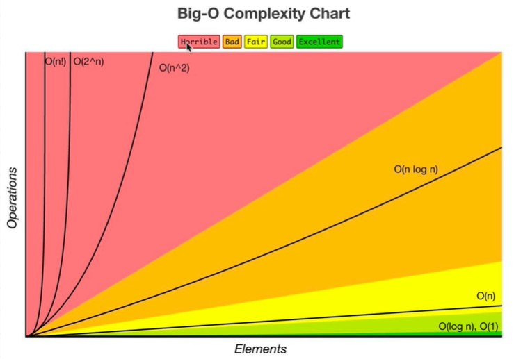
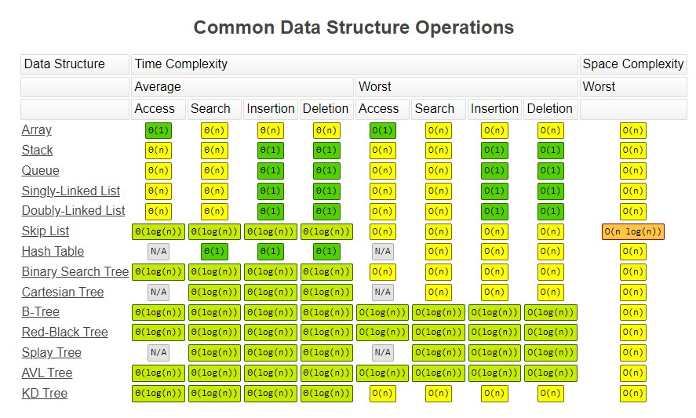
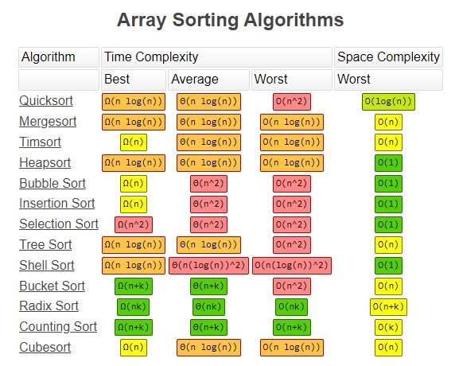
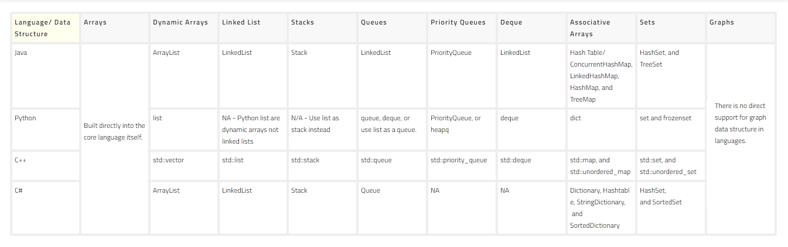

# Data Structure and Algorithms Files
## A repo containing practice files for Data Structures and Algorithms

Mind Map for DSA practice: https://coggle.it/diagram/W5E5tqYlrXvFJPsq/t/master-the-interview-click-here-for-course-link/c25f98c73a03f5b1107cd0e2f4bce29c9d78e31655e55cb0b785d56f0036c9d1

### Big O Chart

### Time / Space Complexity

### Big O for Sorting Algorithms

### Data Structures in Different Languages

